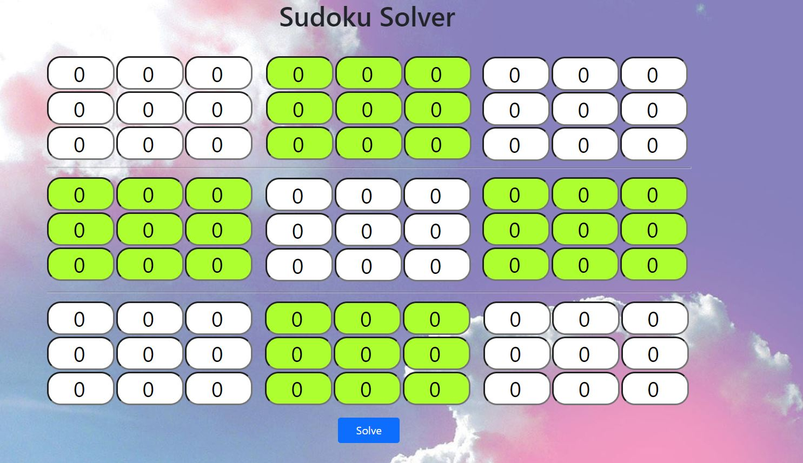
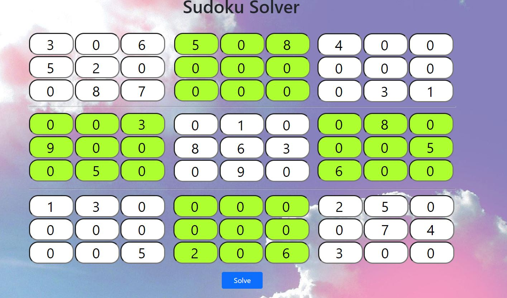
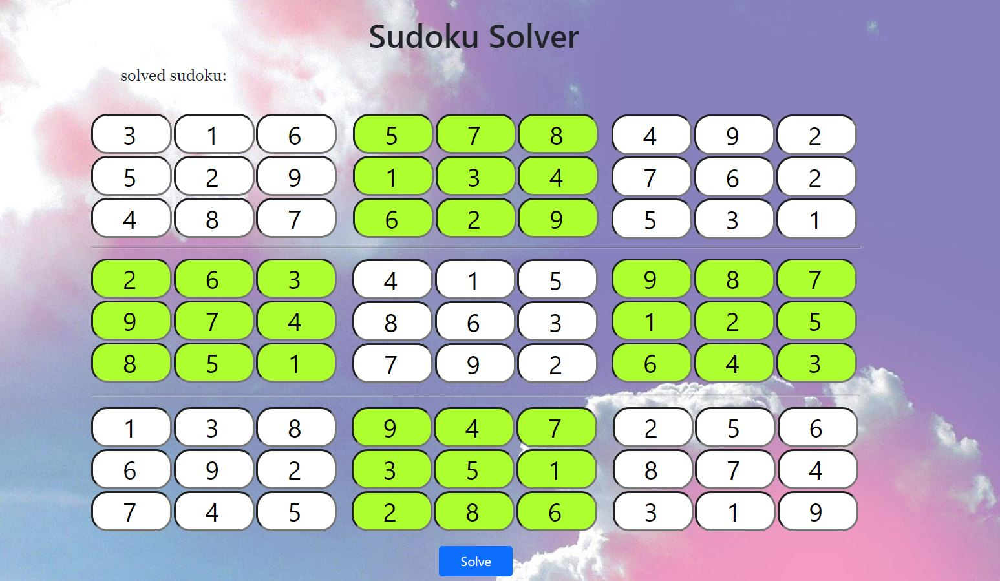
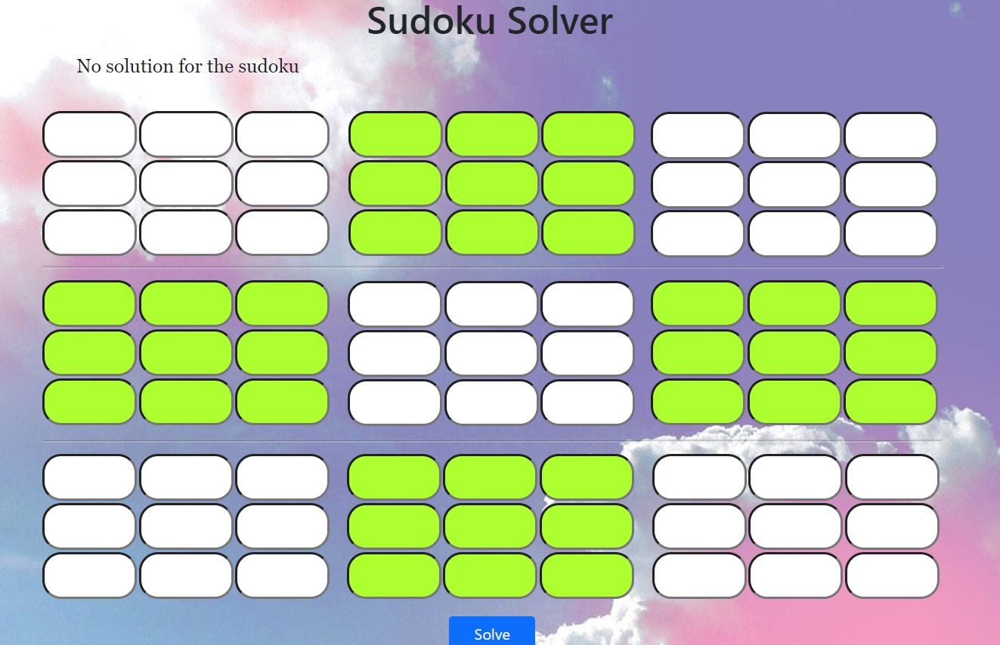

# Sudoku-Solver

I created a small website which only contain two webpages, this website is a 9X9 sudoku solver which runs on Flask and usings backtracking algorithm to solve the sudoku.
so the home page is a unfilled 9X9 sudoku:

  
In order to solve a particular sudoku, you can fill the grid accordingly and press on the solve button,

  

This will be return a solved sudoku:
  

  
And if the solution for that sudoku does not exist it will be return a unfilled sudoku:
  

